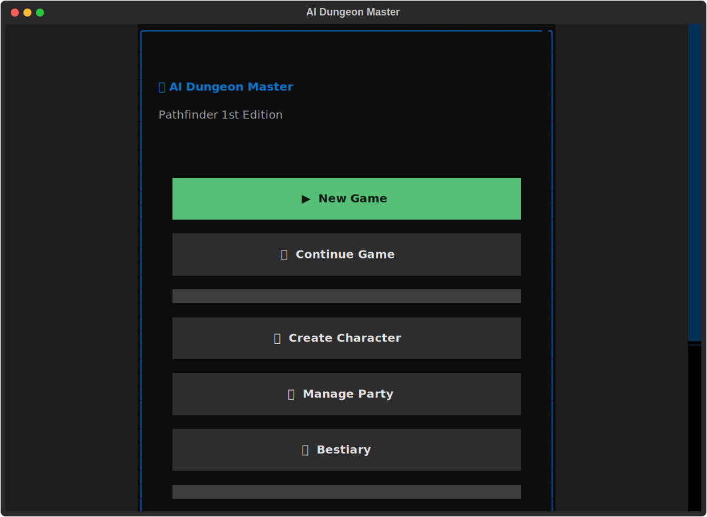

# AI Dungeon Master

A text-based RPG experience for **Pathfinder 1st Edition**, powered by local LLMs via [Ollama](https://ollama.ai). Create characters, form parties, and embark on AI-narrated adventures with full combat, spellcasting, and exploration systems.



## Features

### Character Management
- **Character Creation** - Build characters with race, class, abilities, and equipment
- **Point Buy System** - Standard Pathfinder point buy (10/15/20/25 points)
- **Level Up** - Gain HP, BAB, saves, skill points, and ability increases
- **Party Management** - Form and manage adventuring parties

### Combat System
- **Initiative Tracking** - Automatic initiative rolls and turn order
- **Attack Resolution** - Full attack rolls with critical threats and confirmation
- **Damage & HP** - Track damage, healing, and character status
- **Bestiary** - 21 monsters from CR 1/4 to CR 12 with full stat blocks

### Magic & Spells
- **Spellcasting** - Prepare and cast spells by class
- **Spell Database** - Core spells for Wizard, Cleric, and more
- **Spell Slots** - Track daily spell preparation and usage

### Exploration & Quests
- **World Map** - ASCII map of Sandpoint with travel between locations
- **Quest Tracking** - Track objectives, rewards, and progress
- **NPC Interactions** - Meet NPCs, build relationships, trade items
- **Save/Load** - Persist your campaign progress

### AI Narration
- **Dynamic Storytelling** - AI-generated narrative responses
- **Context Awareness** - AI knows your party, location, and situation
- **Offline Mode** - Works without AI (manual narration)

## Requirements

- Python 3.11+
- [Ollama](https://ollama.ai) (for AI features)
- Recommended models: `hermes3:8b`, `mistral:latest`, or `llama3:latest`

## Installation

1. **Clone the repository**
   ```bash
   git clone https://github.com/TheThreePillars/AiDungeonMaster.git
   cd AiDungeonMaster
   ```

2. **Create a virtual environment** (recommended)
   ```bash
   python -m venv venv

   # Windows
   venv\Scripts\activate

   # Linux/Mac
   source venv/bin/activate
   ```

3. **Install dependencies**
   ```bash
   pip install -r requirements.txt
   ```

4. **Install Ollama** (for AI features)
   - Download from [ollama.ai](https://ollama.ai)
   - Start the Ollama server:
     ```bash
     ollama serve
     ```
   - Pull a model (in another terminal):
     ```bash
     ollama pull hermes3:8b
     ```

## Usage

### Run the Application
```bash
python -m src.main
```

Or run the TUI directly:
```bash
python -m src.ui.app
```

### Navigation
- **Arrow Keys** - Navigate menus
- **Enter** - Select option
- **Escape** - Go back
- **Q** - Quit
- **F1** - Help

### Main Menu Options
- **New Game** - Start a new adventure
- **Continue Game** - Load a saved campaign
- **Create Character** - Build a new character
- **Manage Party** - View and edit your party
- **Bestiary** - Browse monster database
- **Settings** - Configure AI and game options

### In-Game Commands
Type commands in the game session:
- `/roll 1d20+5` - Roll dice
- `/save` - Save your game
- `/combat` - Enter combat mode
- `/inventory` - Open inventory
- `/rest` - Take a rest
- `/map` - View world map
- `/quests` - View quest log

## Configuration

Settings can be configured in-app via **Settings** menu:

### AI Settings
- **Model** - Ollama model to use (default: `hermes3:latest`)
- **Base URL** - Ollama server URL (default: `http://localhost:11434`)

### Game Settings
- **XP Track** - Slow/Medium/Fast progression
- **Point Buy** - 10/15/20/25 point builds
- **Flanking Rules** - Enable/disable flanking bonuses
- **Critical Confirmation** - Require confirmation rolls

## Project Structure

```
AiDungeonMaster/
├── src/
│   ├── main.py              # Application entry point
│   ├── config.py            # Configuration management
│   ├── database/
│   │   ├── models.py        # SQLAlchemy models
│   │   └── session.py       # Database session handling
│   ├── game/
│   │   ├── bestiary.py      # Monster definitions (21 monsters)
│   │   ├── combat.py        # Combat tracker
│   │   ├── dice.py          # Dice rolling engine
│   │   ├── inventory.py     # Item management
│   │   ├── rest.py          # Rest mechanics
│   │   └── spells.py        # Spell database and casting
│   ├── llm/
│   │   ├── client.py        # Ollama API client
│   │   ├── memory.py        # Conversation memory
│   │   └── prompts.py       # AI prompt templates
│   └── ui/
│       ├── app.py           # Main Textual app
│       ├── screens/         # UI screens (14 screens)
│       └── widgets/         # Reusable widgets
├── tests/                   # Test suite (148 tests)
├── requirements.txt
└── README.md
```

## Running Tests

```bash
# Run all tests
python -m pytest tests/ -v

# Run with coverage
python -m pytest tests/ --cov=src --cov-report=term-missing
```

## Bestiary

| CR | Monsters |
|----|----------|
| 1/4 - 1/2 | Giant Rat, Goblin, Skeleton, Zombie, Orc, Hobgoblin |
| 1 | Wolf, Ghoul, Giant Spider |
| 2-3 | Bugbear, Dire Wolf, Ogre, Wight |
| 4-5 | Owlbear, Minotaur, Troll, Wraith |
| 7+ | Hill Giant, Vampire, Young Red Dragon, Lich |

## Dice Notation

The dice engine supports full Pathfinder notation:

```python
from src.game.dice import DiceRoller

roller = DiceRoller()
roller.roll("1d20+5")           # Standard roll with modifier
roller.roll("2d6+4")            # Multiple dice
roller.roll("1d20", advantage=True)   # Roll twice, take higher
roller.roll("4d6", drop_lowest=1)     # Ability score rolling
```

## Tech Stack

- **[Textual](https://textual.textualize.io/)** - Terminal UI framework
- **[SQLAlchemy](https://www.sqlalchemy.org/)** - Database ORM
- **[Ollama](https://ollama.ai)** - Local LLM inference
- **[Pydantic](https://docs.pydantic.dev/)** - Data validation

## License

MIT License

## Contributing

Contributions welcome! Please open an issue or submit a pull request.

## Acknowledgments

- Pathfinder is a trademark of Paizo Inc.
- This project uses the Pathfinder Roleplaying Game Reference Document under the Open Game License.
